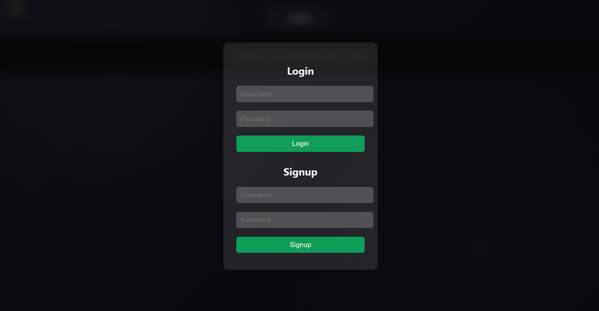
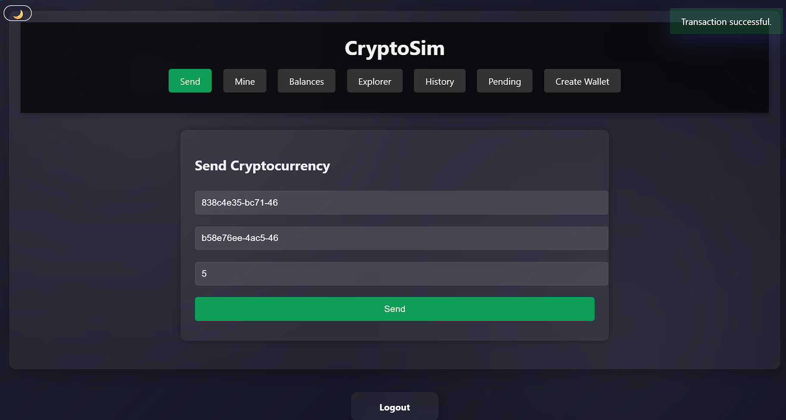
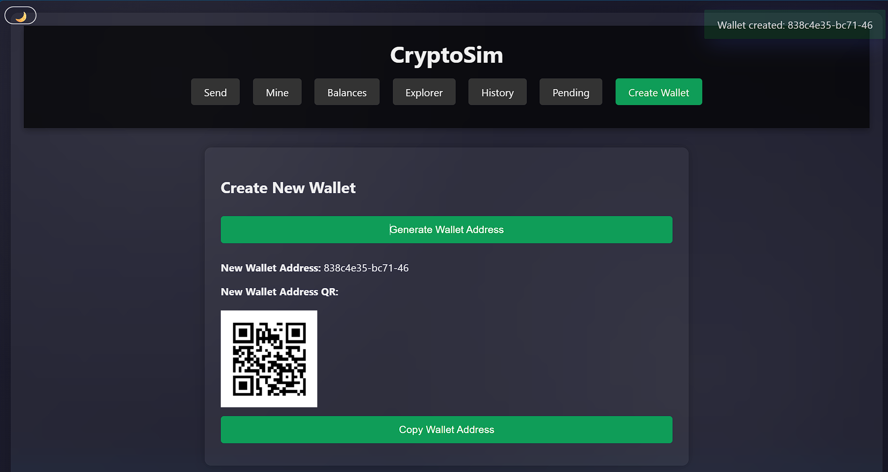
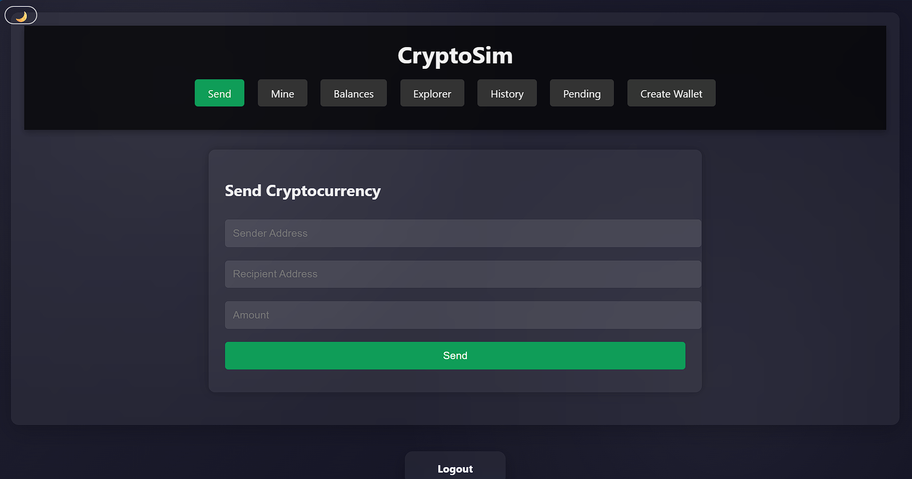
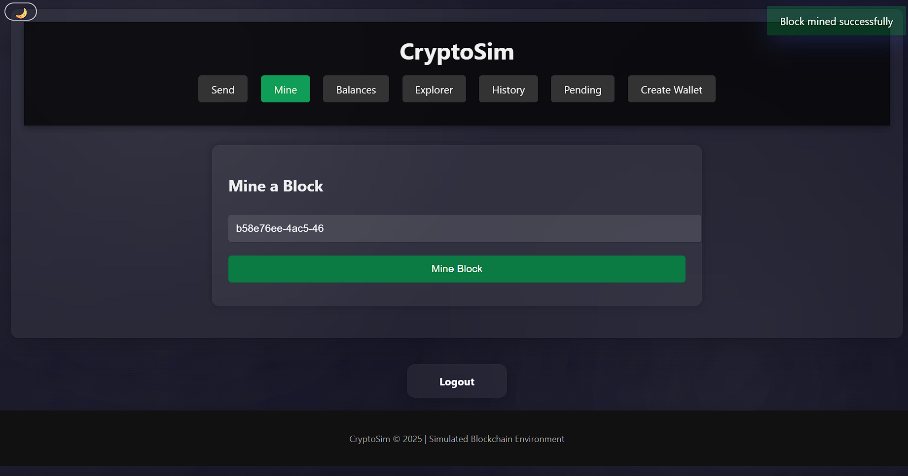
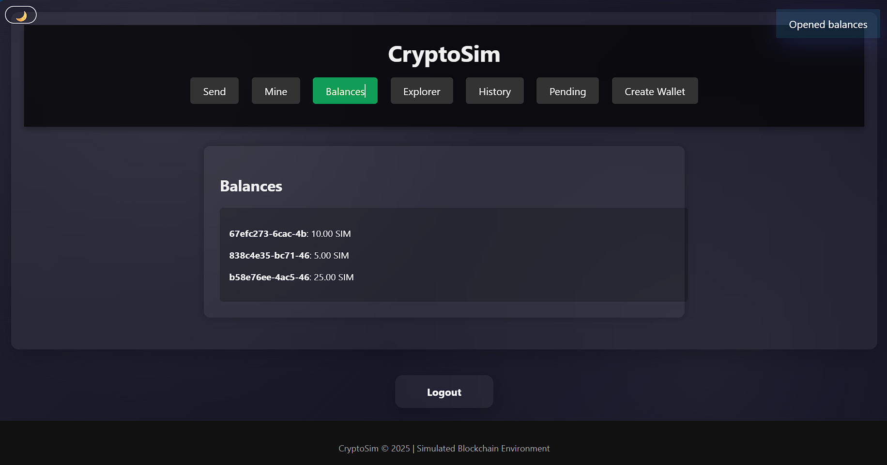
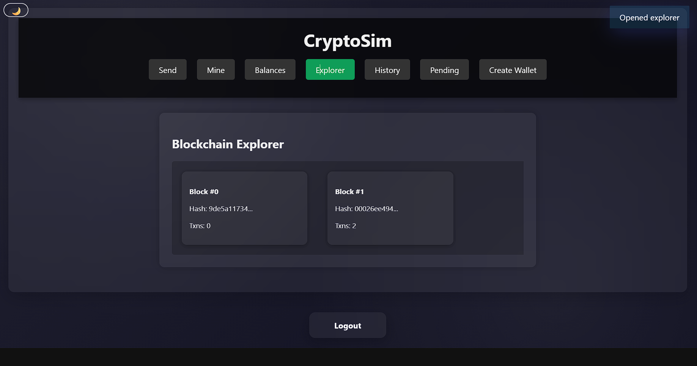
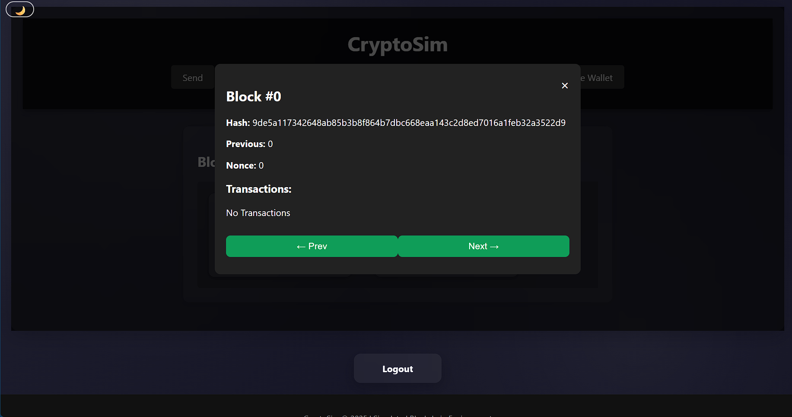
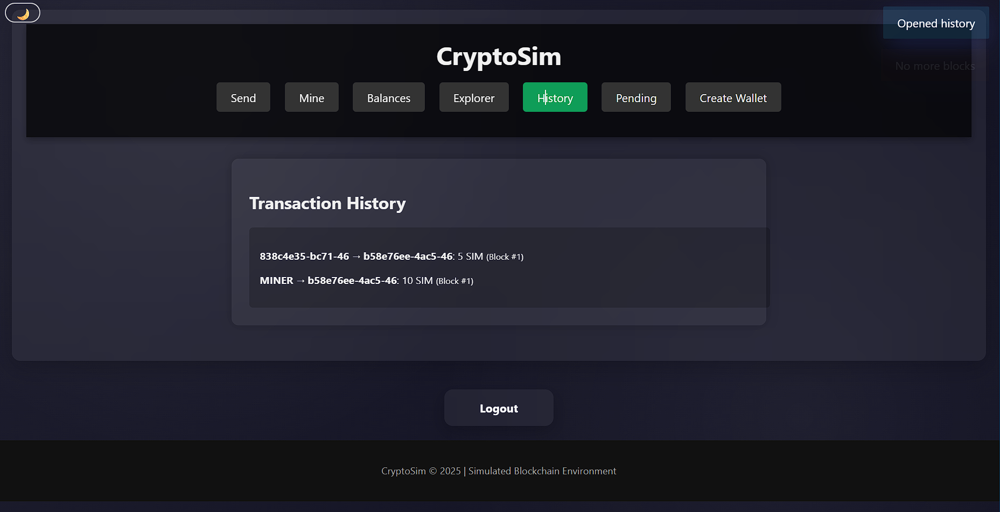
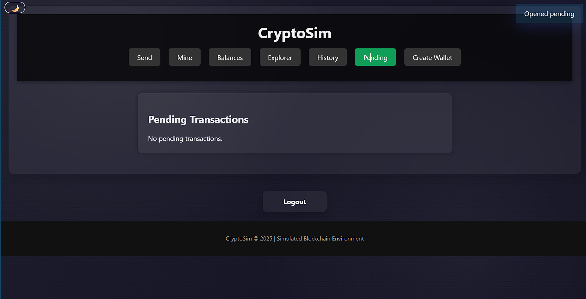

# CryptoCurrency Simulation


A full-stack cryptocurrency and blockchain simulation developed using **Python**, **Flask**, **ECDSA Cryptography**, **Machine Learning**, and **Generative AI**.

The project demonstrates the complete lifecycle of blockchain transactions—from wallet generation and digital signatures to Proof-of-Work mining, fraud detection using Machine Learning, and AI-powered blockchain explanations.

---

## Live Demo

**Application**

https://cryptocurrency-simulation.onrender.com

**GitHub Repository**

https://github.com/saksham0008/CryptoCurrency_Simulation

---

# Project Overview

CryptoCurrency Simulation is a portfolio-oriented blockchain application built to demonstrate practical implementation of modern blockchain concepts.

The application includes:

- Secure user authentication
- Cryptocurrency wallet generation
- Digitally signed transactions
- Proof-of-Work blockchain
- Blockchain explorer
- Transaction history
- Wallet balance management
- Machine Learning based fraud detection
- AI-powered blockchain explanation
- REST API for blockchain operations

The project combines blockchain fundamentals with AI and Machine Learning to create a modern cryptocurrency simulation suitable for educational, research, and portfolio purposes.

---

# Features

| Feature | Description |
|----------|-------------|
| User Authentication | Login & Signup System |
| Wallet Generation | ECDSA Wallet Creation |
| Digital Signatures | Secure Transaction Verification |
| Proof of Work | Mine New Blocks |
| Blockchain Explorer | View Blocks & Transactions |
| Wallet Balances | Real-time Balance Calculation |
| Transaction History | Complete Transaction Records |
| Pending Transactions | View Unconfirmed Transactions |
| Machine Learning | Isolation Forest Fraud Detection |
| AI Explanation | Natural Language Block Explanation |
| REST API | Complete Blockchain API |
| Persistent Storage | JSON-based Blockchain Storage |
| Live Deployment | Render Cloud Deployment |

---

# Architecture

```
                        Flask Application

                    +----------------------+
                    |      app.py          |
                    +----------------------+

                               │

       ┌───────────────────────┼────────────────────────┐

       │                       │                        │

 Authentication         Blockchain Engine         REST API

       │                       │                        │

 Login / Signup        ECDSA Transactions      JSON Responses

       │                       │

       │               Proof of Work

       │                       │

       │               Blockchain Explorer

       │                       │

       ├───────────────┬───────────────┐

       │               │               │

 Machine Learning   AI Explainer   JSON Storage
```

---

# Technology Stack

## Backend

- Python
- Flask

## Frontend

- HTML5
- CSS3
- JavaScript

## Cryptography

- ECDSA
- SHA-256

## Machine Learning

- Scikit-Learn
- Isolation Forest

## Artificial Intelligence

- OpenAI SDK
- Mock AI Engine

## Storage

- JSON

## Deployment

- Render

## Version Control

- Git
- GitHub

---

# Screenshots

## Login Page



---

## Dashboard



---

## Wallet Generation



---

## Send Cryptocurrency



---

## Mine Block



---

## Wallet Balances



---

## Blockchain Explorer



---

## Block Details



---

## Transaction History



---

## Pending Transactions



---

# Installation

Clone the repository

```bash
git clone https://github.com/saksham0008/CryptoCurrency_Simulation.git
```

Move inside the project

```bash
cd "CryptoCurrency Simulation"
```

Create a virtual environment

```bash
python -m venv venv
```

Windows

```bash
venv\Scripts\activate
```

Linux / macOS

```bash
source venv/bin/activate
```

Install dependencies

```bash
pip install -r requirements.txt
```

---

# Running the Application

```bash
python app.py
```

Open

```
http://127.0.0.1:5000
```

---

# REST API

## Authentication

| Method | Endpoint |
|----------|-----------|
| POST | /login |
| POST | /signup |
| GET | /logout |

---

## Blockchain

| Method | Endpoint |
|----------|-----------|
| POST | /send |
| POST | /mine |
| GET | /chain |
| GET | /balances |
| GET | /transactions |

---

## CryptoSim APIs

| Method | Endpoint |
|----------|-----------|
| POST | /api/cryptosim/create_wallet |
| POST | /api/cryptosim/send_transaction |
| POST | /api/cryptosim/mine |
| GET | /api/cryptosim/chain |
| GET | /api/cryptosim/balances |
| POST | /api/cryptosim/analyze |
| GET | /api/cryptosim/explain/<block_index> |
| GET | /api/cryptosim/security_report |

---

# Machine Learning Fraud Detection

The project integrates an **Isolation Forest** model to detect suspicious cryptocurrency transactions before they are added to the blockchain.

The model evaluates:

- Transaction Amount
- Sender Transaction Frequency
- Total Amount Sent
- Total Amount Received

Potentially suspicious transactions are identified using anomaly detection techniques.

---

# AI Block Explanation

The project includes an AI module capable of explaining blockchain blocks in natural language.

Two modes are supported:

- Mock AI Engine (default)
- OpenAI GPT Integration (via `OPENAI_API_KEY`)

This feature converts technical blockchain data into easy-to-understand explanations.

---

# Project Structure

```
CryptoCurrency Simulation/

├── app.py

├── blockchain/
│   ├── block.py
│   ├── blockchain.py
│   ├── transaction.py
│   ├── wallet.py
│   └── __init__.py

├── ai/
│   ├── fraud_detection.py
│   └── explainer.py

├── templates/
│   └── index.html

├── static/
│   ├── style.css
│   └── script.js

├── blockchain_data.json
├── cryptosim_chain.json
├── users.json
├── requirements.txt
├── Procfile
├── test.http
└── README.md
```

---

# Deployment

The application is deployed using **Render**.

Live URL:

https://cryptocurrency-simulation.onrender.com

---

# Future Enhancements

- Peer-to-Peer Blockchain Network
- Merkle Tree Implementation
- Smart Contract Simulation
- Docker Support
- SQLite / PostgreSQL Integration
- WebSocket Based Live Updates
- Advanced Machine Learning Models
- Wallet Import & Export
- Multi-node Consensus

---

# Author

**Saksham Gupta**

B.Tech – Cyber Security

GitHub

https://github.com/saksham0008

LinkedIn

https://www.linkedin.com/in/saksham-gupta0008/

---

# License

This project is developed for educational, research, and portfolio purposes.
